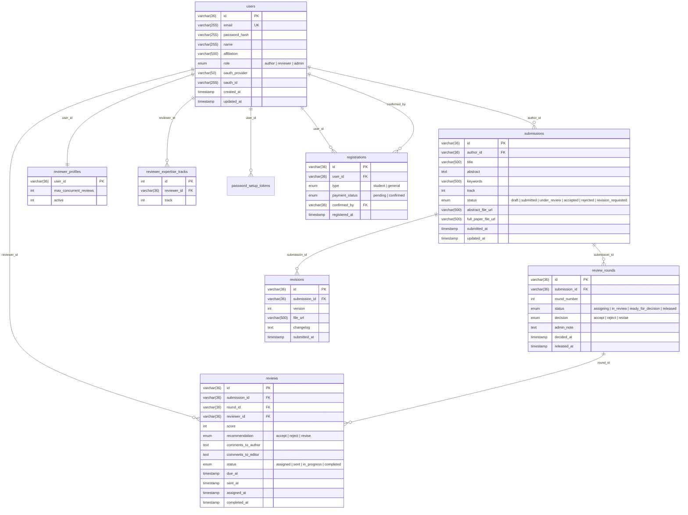

# Database Schema — ENVICON 2026

## ER Diagram (Mermaid)

## สรุปตาราง

| ตาราง | PK | คำอธิบาย |
|---|---|---|
| `users` | UUID (varchar 36) | ผู้ใช้ทุก role (author, reviewer, admin) |
| `submissions` | UUID | บทความที่ส่ง — มี lifecycle: draft -> submitted -> under_review -> accepted/rejected/revision_requested |
| `review_rounds` | UUID | รอบพิจารณาและผลตัดสินที่ admin เผยแพร่แก่ผู้ส่ง |
| `reviews` | UUID | งานประเมินราย reviewer ในแต่ละรอบ (single-blind) |
| `reviewer_profiles` | user UUID | สถานะ active และ capacity ของ reviewer |
| `reviewer_expertise_tracks` | auto_increment int | สาขาความเชี่ยวชาญหลายค่าในแต่ละ reviewer |
| `password_setup_tokens` | UUID | invitation token แบบ hash สำหรับตั้งรหัสผ่าน |
| `email_notifications` | UUID | audit/retry ของ invitation, assignment และผลตัดสิน |
| `registrations` | UUID | การลงทะเบียนเข้าร่วมงาน พร้อมสถานะชำระเงิน |
| `revisions` | UUID | ประวัติเวอร์ชันไฟล์ของแต่ละ submission |

## ความสัมพันธ์ (Foreign Keys)

| FK Column | From Table | To Table | ความหมาย |
|---|---|---|---|
| `author_id` | submissions | users | ผู้เขียนบทความ |
| `submission_id` | review_rounds | submissions | บทความในรอบพิจารณา |
| `round_id` | reviews | review_rounds | รอบของ assignment/result |
| `reviewer_id` | reviews | users | ผู้ review |
| `user_id` | reviewer_profiles | users | profile ของ reviewer |
| `reviewer_id` | reviewer_expertise_tracks | users | สาขาความเชี่ยวชาญของ reviewer |
| `user_id` | registrations | users | ผู้ลงทะเบียน |
| `confirmed_by` | registrations | users | admin ที่ยืนยันการชำระเงิน |
| `submission_id` | revisions | submissions | บทความที่มีการแก้ไข |
