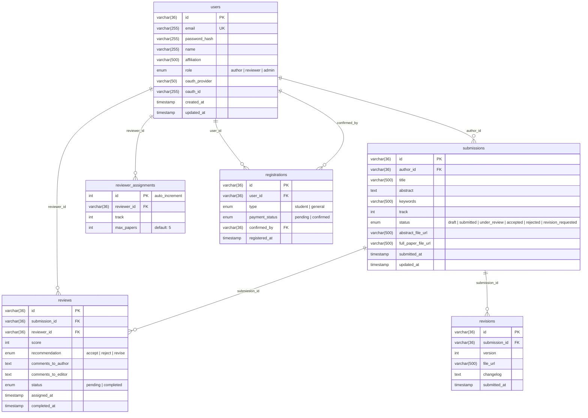

# Database Schema — ENVICON 2026

## ER Diagram (Mermaid)

## สรุปตาราง

| ตาราง | PK | คำอธิบาย |
|---|---|---|
| `users` | UUID (varchar 36) | ผู้ใช้ทุก role (author, reviewer, admin) |
| `submissions` | UUID | บทความที่ส่ง — มี lifecycle: draft -> submitted -> under_review -> accepted/rejected/revision_requested |
| `reviews` | UUID | ผลการ review แต่ละครั้ง (double-blind) |
| `reviewer_assignments` | auto_increment int | กำหนด track และจำนวน paper สูงสุดต่อ reviewer |
| `registrations` | UUID | การลงทะเบียนเข้าร่วมงาน พร้อมสถานะชำระเงิน |
| `revisions` | UUID | ประวัติเวอร์ชันไฟล์ของแต่ละ submission |

## ความสัมพันธ์ (Foreign Keys)

| FK Column | From Table | To Table | ความหมาย |
|---|---|---|---|
| `author_id` | submissions | users | ผู้เขียนบทความ |
| `submission_id` | reviews | submissions | บทความที่ถูก review |
| `reviewer_id` | reviews | users | ผู้ review |
| `reviewer_id` | reviewer_assignments | users | ผู้ review ที่ถูกมอบหมาย track |
| `user_id` | registrations | users | ผู้ลงทะเบียน |
| `confirmed_by` | registrations | users | admin ที่ยืนยันการชำระเงิน |
| `submission_id` | revisions | submissions | บทความที่มีการแก้ไข |
